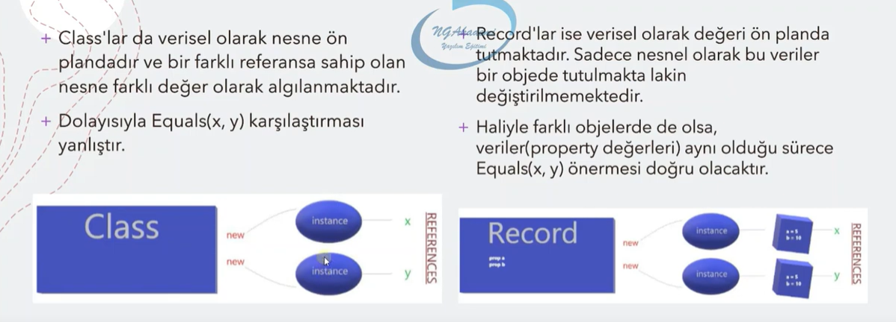

# Class(Sınıf) Yapısı 
Atık nesne tabanlı programlamaya(OOP) sınıflar ile giriş yapmış bulunmaktayız. 
Nesne(object)'ler sınıfların birer örneğidirler. Bu durumda sınıf, nesnelerin 
nasıl inşa edileceğini tanımlayan bir kılavuzdur diyebiliriz. Sınıf soyut bir ifadedir, 
nesneler oluşuncaya kadar fiziksel olarak bellekte yer almazlar.

Sınıf yapısının özellikleri:  
* Sınıflar bir referans tipidir.
* Sınıflar; namespace içerisinde, namespace dışarısında ve class içerisinde oluşturulabilirler.
  Fonksiyonlar vs gibi yapıların içerisinde tanımlanamazlar. Bununla birlikte sınıf tanımlamasında,
  tanımlanan yerde aynı isimde birden fazla sınıf tanımlanamaz.
* Sınıflarda erişim belirleyicisi yazılır. Yazılmamış ise varsayılan olarak Internal'dır.
* Sınıf üyeleri için de erişim belirleyicisi yazılır. Sınıf üyeleri için erişim belirleyicisi belirtilmediğinde
  varsayılan olarak Private olur.
* Sınıf içerisinde metod, property veya field oluşturulabilir.
* Sınıf üyelerine . operatörü üzerinden erişilir.

**Not:** Belleğin stack alanında değer türlü değişkenler ve referanslar tutulur. Belleğin 
heap alanında ise sadece nesneler tutulur. Geliştirme sürecinde belleğin heap alanına doğrudan müdahale
edemediğimz için heapteki nesneyi stackte oluşturduğumuz bir referans ile işaretleyerek ulaşır ve kullanırız.

**Not:** Eğerki bir değişken sınıf içerisinde field olarak tanımlanıyorsa tipine göre default değeri verilir.
Yok eğer sınıfta değil metot vs. içerisinde tanımlanıyorsa default değer verilmez.

**Not:** Sınıf içerisindeki tanımlanan bir sınıf, ana sınıfın elemanı değildir.

**Not:** Oluşturulan referanslar bir nesneyi işaretlemiyorsa null değerini alır.

**Not:** Referans etmeden nesne oluşturabilmekteyiz. Referansız nesnelere ulaşılamaz.
          Bellekte yer kaplamaması için bir süre sonra garbage collector tarafından otomatik olarak silinir.

```cs
namespace WorkArea{

  class Example1{
    private int userId; // Field // Default değeri = 0
    int userOld; 
    public string userName;
  }
  
  class Program
  {
      static void Main(string[] args){
        new Example1(); // Heap te nesne oluşturur ama stack ta referans numarası oluşturmaz.
        Example1 o1 = new Example1();   // Heap bellekte nesne oluşturur ve stack bellekte "o1" adı ile referans numarası oluşturur.
        Example1 o2 = new Example1();   // o2 ve o3 referanslarının heap bellekte gösterdiği nesne aynıdır.
        Example1 o3 = o2;
  
        Example1 example1 = new Example1();
        example1.userOld = 100; // Sınıf üyelerine . operatörü üzerinden erişip kullanabilirsiniz.
  
        Example1 example2; // example2 = null
      }
  }

}
```

## Field, Metod, Property Tanımı
* Field : Bir class yada struct içinde tanımlanan her tipten değişkendir.
* Metod : Bir class yada struct içinde tanımlanan fonksiyonlardır.
* Property :  Yazılımcılar nesnelerin içerisindeki field'lara direkt erişilmesini istemez. Propertyler ile
              fieldları dışarı kontrollü bir şekilde açabiliriz. İçerisinde get ve set blokları vardır.
              Property hangi tipten bir field'ı temsil ediyorsa o tipten olmalıdır. Propertler özünde bir metottur.              

**Not:** Propertler genellikle temsil ettikleri fieldların isimlerinin baş harfi büyük olacak şekilde isimlendirilirler.
                                 
**Not:** Field tanımlamadan da property oluşturulabilir. Bu durumda property aynı zamanda field gibi davranır.

**Not:** Propertylerde set bloğu tanımlanmazsa sadece okunabilir(readonly) bilakis get bloğu tanımlanmazsa sadece
yazılabilir(writeonly) olacaktır.

**Not:** Sınıflar için yapılan bu üç tanım, ileride anlatılacak olan record ve struct yapıları içinde geçerlidir.

### Property İmza Çeşitleri
```cs
namespace WorkArea{

  class Example1{
      private int userId; // Field
      int userOld;   
      public string userName;
      protected string userSurname;
    
      public void metod1() // Metod
      {
          Console.WriteLine("Metod1 e hosgeldiniz...");
      }
    
      // 1. Full Property
      // Sınıf içinde private bir field oluşturulur ve tanımlanan property o field'a kontrollü erişim sağlar.
      int sayı1;
      public int MyProperty1 {
          get{
            return sayı1;
          }
          set{
            sayı1 = value;
          }
      }
    
      // 2. Prop Property (AutoPropert)
      public int MyProperty2 { get; set; } // Prop propertler compile edildiklerinde arka tarafta kendi field'larını oluştururlar. Dolayısıyla field tanımlamaya gerek yoktur.
    
      // 2.1 AutoProperty Initializer
      // Bu özellik ile AutoProperty'ye ilk değer atanabilir.
      public int MyProperty3 { get; set; } = 10;
    
      // 3. Ref Readonly Returns
      // Bir sınıf içerisindeki field'ı referansıyla döndürmemizi sağlayan, bununla birlikte değişkenin değerini read only yapan özelliktir.
      string isim = "Alperen Bektaşoğlu";
      public ref readonly string Isim => ref isim;
    
      // 4. Expression - Bodied Property
      // Tanımlanan propertyler de Lambda Expression kullanmamızı sağlayan söz dizimidir. Expression - Bodied Propertyler readonly dir.
      public string Cinsiyet => "Erkek"; // Get bloğu sonucu Erkek değeri döner.
    
      // 5. Inıt - Only Property
      // Nesnenin sadece ilk yaratılış anında propertlerine değer atanmaktadır. Devamında değiştirilemezler.
      // init, get anahtar kelimesi olmaksızın kullanılamaz. Ayrıca yapısı gereği bu semantikte set bloğuda kullanılamaz.
      public int MyProperty4 { get; init; };
      public int MyProperty4 { get; init; } = 10;
    }

}
```


**Not:** Property olmadan da propertylerin sağladığı imkanı metodlarla da oluşturabilmekteyiz ama propertyleri kullanarak
kod kalabalığının önüne geçmiş oluruz.

**Not:** Sınıfa ve sınıfın elemanlarına açıklama satırı nasıl eklemek için, eklenecek öğenin üstüne gelip "///" yazıp tab tuşuna
basmanız yeterlidir.

## Encapsulation Nedir?
Bir nesne içerisindeki fieldların dışarıya kontrollü bir şekilde açılması ve dışarıdan kontrollü bir şekilde field'a veri almasıdır.
Biz bu işlemi property'ler aracılığı ile gerçekleştirmekteyiz. Tabi metodlar kullanılarakta bu işlem gerçekleştirilebilir ama
bu noktada propertyler'i kullanmak işimizi kolaylaştırmaktadır.

## New Operatörü
new operatörü nesne üretilirken kullanılmaktadır.

**Not:** Nesne üretilirken kullanılan new ifadedesinde ki parantezler yapıcı metodu çağırır.

**Not:** C#9.0 da gelen Target-Typed New Expressions özelliği ile aşağıdaki şekilde tanımlamakta mümkündür.
```cs
Example1 example1 = new Example1();
Example1 example1 = new (); //  Target-Typed New Expression
```

## Nesne Kopyalama Davranışları | Shallow Copy | Deep Copy
Shallow Copy: Var olan bir nesnenin, değerin, referansın kopyalanmasıdır. Shallow copy sonucunda eldeki değer
çoğaltılmaz. Sadece birden fazla referans ile işaretlenmiş olur. Referans tipli değişkenlerin default davranışı bu şekildedir.

```cs
Example1 o1 = new Example1(); // o1 ile o2 nin heap te referans ettiği nesne aynıdır.
Example1 o2 = o1;
```

Deep Copy: Var olan bir nesne deep copy ile kopyalanıyorsa eğer, ilgili nesne miktarı çoğalır. Aynı özelliklere ve
değere sahip olan bellekte farklı bir nesne daha oluşur. Değer tipli değişkenlerin default davranışı bu şekildedir.
Aşağıda bir sınıftan nasıl deep copy yapılabileceği ile ilgili bir örnek mevcuttur.

```cs
class Example1{
  public Example1 Clone(){
    this.MemberwiseClone(); // Bir sınıfın içerisinde o sınıftan üretilmiş olan o anki nesneyi klonlamamamızı sağlayan fonksiyondur.
  }
}

class Program
{
    static void Main(string[] args){
      Example1 o1 = new Example1();
      Example1 o2 = o1; // Shallow Copy
      Example1 o3 = o1.Clone(); // Deep Copy
    }
}
```

## Redords Nedir?
C# 9.0 ile gelen Inıt-Only Properties özelliği, nesne üretim esnasının dışında değişmez değerler
oluşturulması için constructor ve auto propert initializers yapısının yanında object initializer 
yapısının kullanılabilir olmasını sağlıyordu. Eğer ki bir nesnenin tamamını değişmez yapmak isyorsak ozaman 
daha fazlasına ihtiyacımız olacak. İşte bu ihtiyaca istinaden Records türü geliştirilmiştir. Yani özetle
records içindeki bütün propertler Inıt-Only Propert dir. Record, bir nesnenin topyekün olarak sabit/değişmez olarak
kalmasını sağlamaktadır. Recordlar hafif sınıflardır. Sınıflara nazaran nesneden ziyade içerisinde bulunan dataları
sabitleyerek, verilerin öne çıkmasını sağlarlar. Özetle recordlar değiştirilemez nesneler oluşturmamızı 
sağlamaktadır. 



**Not:** Record bildiğiniz sınıf fıtratında bir yapılanma olduğundan dolayı içerisine her türlü sınıf elemanı 
tanımlanabilmektedir. Haliyle tanımlanan propertylerin hepsinin init ile işaretlenmesi Record'ın esas amacına eşlik edecektir.

```cs
public record Example1{
   public string Name {get; init;}
   public string Author {get; init;}
   public int PageNumber {get; init;}
}
```

**Not:** Recordlarda ki property leri değiştirerek yeni bir record oluşturmak için With Expression yapısı kullanılabilir.

```cs
class Program
{
    static void Main(string[] args){
      Example1 example1 = new example1{
        Name = "Ateşten Gömlek",
        Author = "Halide Edip Adıvar"
        PageNumber = 200
      }
      
      Example1 example2 = example1 with {Author = "Alperen Bektaşoğlu"};
      Example1 example3 = example1 with {Author = "Alperen Bektaşoğlu", PageNumber = 500};
    }
}
```

## Constructor Method (Yapıcı Metotlar)
* Constructor metod, bir sınıftan her nesne üretildiğinde ilk ve otomatik tetiklenen metoddur. Bir sınıfta constructor metod tanımlanmadıysa,
default constructor metod çalışır.
* Bir sınıfta farklı imzalarda birden fazla constructor metod olabilir.
* Constructor metodun ismi sınıfın ismi ile aynı olmalıdır.
* Constructor metod public olmalıdır.
* Constructor metodun geri dönüş değeri olmaz.

```cs
namespace EducationWorkspace
{
    class Example1
    {
        private int userId;
        public string userName;

        public Example1()
        {
            Console.WriteLine("Yapıcı metod çalıştı...");
        }

        public Example1(int id)
        {
            userId = id;
            Console.WriteLine("Parametreli yapıcı metod çalıştı...");
        }
    }

    class Program
    {
        static void Main(string[] args)
        {
            Example1 o1 = new Example1();
            Example1 o2 = new Example1();
            Example1 o3 = new Example1();
            Example1 o4 = new Example1(100);
            Console.ReadLine();
        }
    }
}

// Çıktı:
// Yapıcı metod çalıstı...
// Yapıcı metod çalıstı...
// Yapıcı metod çalıstı...
// Parametreli yapıcı metod çalıstı...
```

**Not:** Bir yapıcı metodun erişim belirleyicisi private yapılırsa, o sınıftan new komutu ile nesne üretilemez.

**Not:** Record'larda da yapıcı metodlar tanımlanabilir.

## Destructor Method (Yıkıcı Metotlar)
* Destructor metod, classtan üretilen nesne yıkılmadan önce tetiklenir.
* Erişim belirleyicisi yoktur ve geriye değer döndürmez. 
* ~ işareti ile başlar ve class'ın ismi ile aynı isimdedir.
* Bir sınıfta sadece tek bir tane yıkıcı metod tanımlanabilir.

### Peki Bir Nesne Hangi Şartlarda Kim Tarafından İmha Edilir?
Bir nesnenin imha edilmesi için; ilgili nesne herhangi bir referans tarafından işaretlenmemelidir yahut nesnenin oluşturulduğu 
ve kullanıldığı scope sona ermiş olmalıdır. Özetle ilgili nesneye bir daha erişilemez hale gelinmelidir.
işte o zaman nesne garbage collector tarafıdnan imha edilir. Garbage Collector otomatik çalışır ama istersek kod üzerinden 
bizlerde tetikleyebilmekteyiz.

```cs
namespace EducationWorkspace
{
    class Example1
    {
        private int id;

        public Example1(int sayac) // Yapıcı Metod
        {
            id = sayac;
            Console.WriteLine($"Yapıcı metod çalıştı... ({id})");
        }

        ~Example1() // Yıkıcı Metod
        {
            Console.WriteLine($"Yıkıcı metod çalıştı... ({id})");
        }
    }

    class Program
    {
        static void Main(string[] args)
        {
            Console.WriteLine("************ Yapilis Sureci ****************");

            for (int i = 0; i < 10; i++)
                new Example1(i);

            Console.WriteLine("************ Yikilis Sureci ****************");
            GC.Collect();    
            Console.ReadLine();
        }
    }
}
```

## Deconstruct Metotlar
Bir sınıf içerisinde "Deconstruct" ismiyle tanımlanan metot, compiler tarafından özel olarak algılanmakta ve sınıfın
nesnesi üzerinden geriye hızlıca Tuple bir değer döndürmemizi sağlamaktadır. Deconstruct metod yapısını aşağıdaki
örnek üzerinden inceleyebilirsiniz.

```cs
namespace EducationWorkspace
{
    class Example1
    {
        public string Name { get; set; }
        public int Age { get; set; }

        public void Deconstruct(out string isim, out int yas)
        {
            isim = Name;
            yas = Age;
        } 
    }

    class Program
    {
        static void Main(string[] args)
        {
            Example1 o1 = new Example1
            {
                Name = "Alperen",
                Age = 26
            };

            var (param1, param2) = o1;
            Console.WriteLine(param1);
            Console.WriteLine(param2); 
            Console.ReadLine();
        }
    }
}

// Çıktı:
// Alperen
// 26
```

## Static Constructor Metod
* Static constructor metod, normal constructor metod dan önce çalışır.
* İlgili sınıftan yapılan nesne taleplerinden ilkinde çalışır, daha sonraki taleplerde çalışmaz.
* Static constructor metotda; erişim belirleyicisi ve geri dönüş tipi yoktur. "static" kelimesi ile işaretlenirler.
* Bir sınıfta en fazla 1 tane static constructor metod tanımlanabilir.

```cs
namespace EducationWorkspace
{
    class Example1
    {
        public Example1() // Constructor Metod
        {
            Console.WriteLine("Constructor metod çalıştı...)");
        }

        static Example1() // Static Constructor Method
        {
            Console.WriteLine("Static constructor çalıştı...");
        }
    }

    class Program
    {
        static void Main(string[] args)
        {
            Example1 o1 = new Example1();
            Example1 o2 = new Example1();
            Example1 o3 = new Example1();
            Console.ReadLine();
        }
    }
}

// Çıktı:
// Static constructor çalıstı...
// Constructor metod çalıstı...)
// Constructor metod çalıstı...)
// Constructor metod çalıstı...)
```

**Not:** Static constructor'ın tetiklenebilmesi için illa nesne üretimi yapılmasına gerek yoktur.
İlgili sınıf içerisinde herhangi bir static yapılanmanında tetiklenmesi static constructor'ın
tetiklenmesini sağlayacaktır.


## This Anahtar Kelimesi
This anahtar kelimesinin kullanım amaçları:
1. Sınıfın nesnesini temsil eder. İlgili sınıf yapılanmasının o anki nesnesine karşılık gelir.
2. Birinci maddedeki çalışma prensibi üzerinden, aynı isimde ki field ve metod parametrelerini ayırmak için kullanılır.
3. Bir yapıcı metoddan aynı sının içerisindeki başka bir yapıcı metodu çağırmak için kullanılır.

```cs
namespace WorkArea{

  class Example1{
    public string userName;

    public Example1() : this("Alperen")
    {
        Console.WriteLine("Parametresiz Yapıcı Metod");
    }

    public Example1(string userName) : this(userName, 10)
    {
        this.userName = userName; // 1. ve 2. Madde Örneği
        Console.WriteLine("1 Parametreli Yapıcı Metod");
    }

    public Example1(string userName, int yas){
        Console.WriteLine("2 Parametreli Yapıcı Metod");
    }
  }
  
  class Program
  {
      static void Main(string[] args){
          Example1 e1 = new Example1();
          // Output:
          // 2 Parametreli Yapıcı Metod
          // 1 Parametreli Yapıcı Metod
          // Parametresiz Yapıcı Metod
      }
  }

}
```


