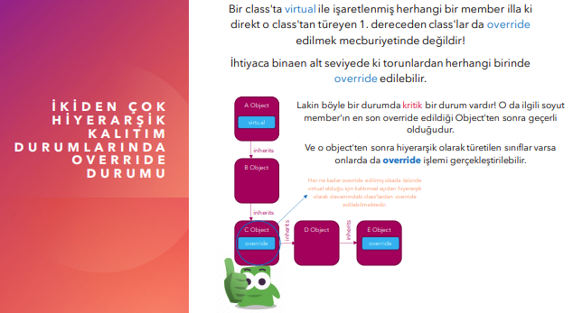

## Sanal Yapılar | virtual - override

* Bir nesne üzerinde var olan tüm memberların tamamı derleme zamanında belirgindir. Yani, derleme aşamasında hangi nesne üzerinden hangi metotların çağrılabileceği
bilinmektedir. Sanal yapılar ile derleme zamanında kesin bilinen bu bilgi run time(çalışma zamanı)da belirlenebilmektedir. Yani ilgili nesnenin hangi metodu
kullanacağı bilgisi run time'da kararlaştırılır.

* Sanal yapılar, bir sınıf içerisinde bildirilmiş olan ve o sınıftan türeyen alt sınıflarda da tekrar bildirilebilen yapılardır. Bunu
zaten Name Hiding ile yapabiliyorduk. Evet, Name Hiding ile bir sınıftaki herhangi bir member'ı ondan türeyen torunlarda
oluşturabiliyoruz ve buradaki yaşanan çakışmaya da Name Hiding diyoruz. Lakin, sanal yapılarda olay bu şekilde değildir. Bir
sınıfta bildirilen sanal yapı(metot ya da property) bu sınıftan türeyen torunlarında ezilebilmekte yani devre dışı bırakılıp
yeniden oluşturulabilmektedir. Yani sanal yapılanmalarda Name Hiding'de olduğu gibi bir isimsel çakışmadan
ziyade üstten gelen bir yapının işlevini iptal edip yeniden yapılandırmak vardır. işte burada bir sınıfta
tasarlanmış sanal yapının işlevinin iptal edilip edilmeme durumuna göre tanımlandığı sınıftan mı yoksa bu sınıfın
torunlarından mı çağrılacağının belirlenmesi run time'da gerçekleşecektir.

* Sanal yapılar illa ki kendisinden türeyen torunlarda ezilmek/yeniden yazılmak zorunda değildir.

* Bir sınıfta sanal yapı oluşturabilmek için ilgili member'ın(metot ya da property) imzasını virtual keywordü ile işaretlemek yeterlidir.

* Bir class'ta virtual ile işaretlenerek sanal hale getirilmiş bir
member(metot ya da property), bu class'tan miras alan
torunlarında ezilmek/yeniden yazılmak isteniyorsa eğer ilgili
class'ta imzası override keywordü işaretlenmiş bir vaziyette
tekrardan aynı member oluşturulur.

**Not:** Yukarıdaki örnekte D nesnesi, C sınıfında override edilmiş elemanı kullanır.

