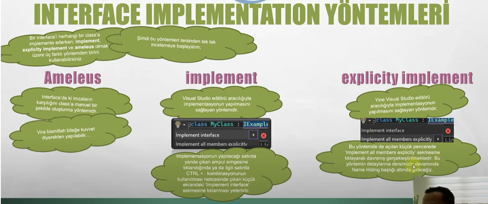
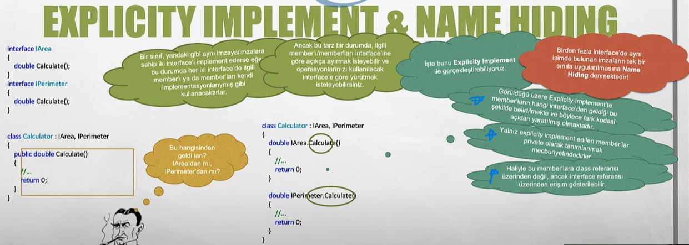

## Interface (Arayüz)
Arayüzler, sınıflara rehberlik etmek üzere oluşturulan nesneye dayalı programlamanın en önemli özelliklerinden biridir. Sınıfların hangi metotları ve özellikleri içermesi gerektiği 
arayüzler içerisinde bildirilebilir. Arayüzler içerisinda sadece metotlar yada propertyler olabilir. Arayüzler içerisinde field'lar oluşturulamaz. Arayüzler içerisinde ki üye imzalarında 
erişim belirleyicisi kullanılmaz. Abstaction(sanallaştır) için sıklıkla arayüzler kullanılır.

Interfacelerin genel özelliklerini sıralayacak olursak;
1. Nesne oluşturulmaz ama referans noktası alınabilir.
2. Bir sınıf birden fazla interface implemente edebilir.
3. Interface içerisine sadece üye imzaları tanımlanabilir ve erişim tipi belirtilmez. C# 8.0 ile gelen "default interface methods" özelliği ile
arayüzler içerisinde metodların varsayılan gövdeleri oluşturulabilir.
4. Interface te name hiding problemi ile karşılaşılabilir. Name hiding'i anlamak için bu <a href="https://www.youtube.com/watch?v=863_jnRhqZ0">link</a>'ten videoyu açarak, 16:15 ten itibaren izleyebilirsiniz.

**Not:** Bir sınıf öncelikli olarak bir sınıftan miras alıyor ise ilk o miras aldığı sınıf belirtilmelidir. Daha sonra implement edilecek arayüzler yazılır.

```cs
class A : B, IOrnek1, IOrnek2 {

}
```

**Not:** Son olarak bir interface başka bir interface'den kalıtım alabilir. Örnek üzerinden gitmek gerekir ise:
* IB, IA arayüzünden kalıtım aldığını varsayalım.
* C isimli sınıfın da IB arayüzünden kalıtım aldığını varsayarsak:
* C sınıfı içerisinde her iki interface'in üyelerinin gövdeleri oluşturulmak zorundadır.
* Bunula birlikte C sınıfı üzerinden C, IB ve IA referansları oluşturulabilir.

```cs
namespace EducationWorkspace
{
    interface IOrnek1
    {
        int X();
        int MyProperty { get; set; }
    }

    interface IOrnek2
    {
        int X();
        int Z();
    }

    class A
    {

    }

    class B : A, IOrnek1, IOrnek2
    {
        public int MyProperty { get => throw new NotImplementedException(); set => throw new NotImplementedException(); }

        public int X()
        {
            throw new NotImplementedException();
        }

        public int Z()
        {
            throw new NotImplementedException();
        }
    }

    class Program
    {
        static void Main(string[] args)
        {
            IOrnek1 o1 = new B();
            // o1.X();
            // o1.MyProperty = 100;

            IOrnek2 o2 = new B();
            // o2.Z();
            // o2.Z();

            B o3 = new B();
            // o3.MyProperty = 100;
            // o3.X();
            // o3.Z();
            
            Console.ReadLine();
        }
    }

}
```


